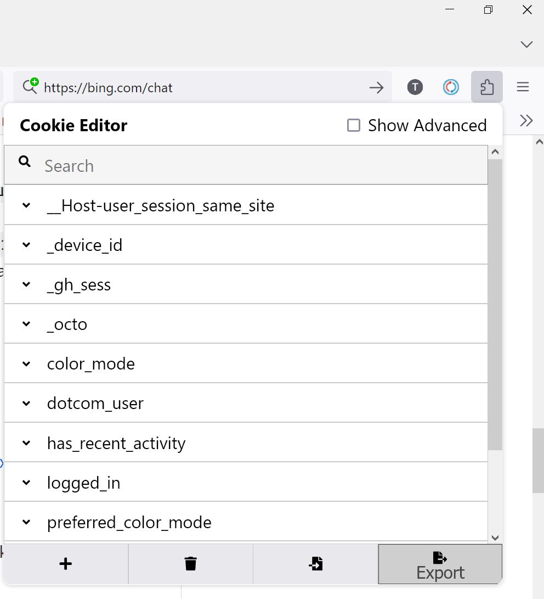

# openai
There are two types of dialog AI systems: online interactive dialog AI via browser and terminal command AI in batch style. To use terminal command AI, their settings are required respectively.

This repository will introduce three types of dialog AI systems: ChatGPT-3 with Openai, EdgeGPT with Microsoft and Google Bard. 

The following links are online interactive dialog AI systems via browser for free of charge:

ChatGPT-3 with any browser: https://chat.openai.com/

Bard with any browser: https://bard.google.com/

Bing with Edge browser using ChatGPT-4: https://bing.com/chat

https://blogs.bing.com/search/march_2023/Confirmed-the-new-Bing-runs-on-OpenAI%E2%80%99s-GPT-4

# Simple examples via browser

1. Query to AI: show a code in Python to display a graph with data.csv 
   composed of x and y determinants.
<pre>
Answer from AI:
import pandas as pd
import matplotlib.pyplot as plt

data = pd.read_csv('data.csv')
x = data['x']
y = data['y']

plt.plot(x, y)
plt.show()
</pre>

2. Query to AI: who is yoshiyasu takefuji?
<pre>
Answer from AI:
Yoshiyasu Takefuji is a professor at **Musashino University** in the **Data Science** department². He has a Ph.D. and his research interests include cyber-security, machine learning, neural computing, energy harvesting, IoT, automated reasoning, and applied AI². He has developed AI prototypes that outperform super-skilled humans in civil engineering and construction, marketing, skin cancers, and many other areas². Is there anything else you would like to know about him?

Source: Conversation with Bing, 2023/5/13
(1) Yoshiyasu TAKEFUJI | Professor | Ph.D. Professor .... https://www.researchgate.net/profile/Yoshiyasu-Takefuji.
(2) 武藤 佳恭 (Takefuji Yoshiyasu) - マイポータル - researchmap. https://researchmap.jp/ytakefuji.
(3) ytakefuji (Yoshiyasu Takefuji) · GitHub. https://github.com/ytakefuji.
</pre>
3. Query to AI: show a list of publications by yoshiyasu takefuji in 2023.
<pre>
Answer from AI:
I’m sorry, but I couldn’t find any specific information about publications by Yoshiyasu Takefuji in 2023. Would you like to know about his publications from another year or more general information about his work?
</pre>
4. Query to AI: show a list of publications by yoshiyasu takefuji in 2023 
   with google query command of "yoshiyasu takefuji site:nih.gov after:2023-1-1"
<pre>
Answer from AI:
hiscovid for visualizing and identifying when policymakers made mistakes against COVID-19
doi: 10.1016/j.simpa.2023.100466

Review of hikikomori: A global health issue, identification and treatment
doi: 10.1016/j.ajp.2023.103596
</pre>
5. Query to AI: summarize them.
<pre>
Answer from AI:

hiscovid for visualizing and identifying when policymakers made mistakes against COVID-19

This paper presents a new tool called hiscovid that can be used to visualize and identify when policymakers made mistakes against COVID-19. hiscovid uses a time-series policy outcome scoring tool to evaluate the outcomes of COVID-19 policies by country. The daily cumulative population mortality is used for scoring the outcomes of COVID-19 country policies. hiscovid allows policymakers to observe the progress and transition of scores over time to learn lessons from the past decision-making mistakes for correcting the current policies to reduce unnecessary deaths.

Review of hikikomori: A global health issue, identification and treatment

This paper reviews the literature on hikikomori, a Japanese term for a condition in which people withdraw from social contact and isolate themselves in their homes for extended periods of time. Hikikomori is a global health issue, with an estimated 1.5 million people in the United States and 1.2 million people in Europe affected by the condition. The paper discusses the identification and treatment of hikikomori, and provides recommendations for future research.
</pre>

# Challenging EXAMPLE

1. Use all 26 letters of the alphabet once and only once to make a meaningful sentence.

Answer from AI:

The quick brown fox jumps over a lazy dog.

Sphinx of black quartz, judge my vow.

Pack my box with five dozen liquor jugs.

The five boxing wizards jump quickly.

# Teriminal command AI with ChatGPT

trans.py with ChatGPT-3 is an example of translation from English to French and Japanese.
The text message "Translate this into 1. French and 2. Japanese:\n\nWhat rooms do you have available?\n." is fed to openai to generate the response.

<pre>
1.API key:
https://platform.openai.com/account/api-keys
open account to obtain API key for OpenAI

2. $ pip install openai

3. $ cat trans.py
# -*- coding: utf-8 -*-
import openai

openai.api_key ="API-key"

res = openai.Completion.create(
  model="text-davinci-003",
  prompt="Translate this into 1. French and 2. Japanese:\n\nWhat rooms do you have available?\n.",
  temperature=0.3,
  max_tokens=100,
  top_p=1.0,
  frequency_penalty=0.0,
  presence_penalty=0.0
)
print(res['choices'][0]['text'])

4. $ python trans.py
1. Quels salles avez-vous disponibles?
2. どの部屋が利用可能ですか？

</pre>

# Exercises
1. Write a program for interactively asking a question and a temperature to ChatGPT and returning the response.

Hint: The temperature is a determinant of randomness from 0.0 to 1.0 to control the randomness. The larger the temperature, the greater the randomness.

2. Write a english-to-japanese translator.

3. Write a program to collect a list of peer-reviewed papers on the specific subject.

# EdgeGPT
EdgeGPT takes advantage of the new version of Bing (Microsoft search engine)
with ChatGPT-3.5 or 4.0.

1. $ pip install EdgeGPT

2. Install the latest Edge browser.

3. Open https://bing.com/chat

4. Install Cookie-Editor for Edge, Firefox or Chrome.

5. Access bing.com with Edge, Firefox or Chrome.

6. From Extensions, click Cookie-Editor

7. Click Export icon of Cookie-Editor

This will copy the cookie to clipboard.

8. Paste the clipboard to the cookies.json file.

9. Run the following program.
<pre>
import asyncio
from EdgeGPT import Chatbot

async def main():
    bot = Chatbot(cookie_path='cookies.json')
    print(await bot.ask("who is yoshiyasu takefuji?"))
    await bot.close()

if __name__ == "__main__":
    asyncio.run(main())
</pre>

# Exercise
0. Make sure cookie-editor in edge browser showing your cookies, not empty. To show the content of cookie-editor, after logging into your Microsoft account at the Edge, you will need to access bing.com.

1. Write a program for interactively asking a question to EdgeGPT and returning the response.

2. Give the text of "solve x+y=3 and 2x+y=2, and verify it" to your program to show the right answer of x and y.

HINT: 
If you have incorrect results, conversation_style must be set in your program.

3. Give the following text "show email for yoshiyasu takefuji" to show the right email address.

4. Write a program in Python to collect a list of peer-reviewed papers on the specific subject.

5. Compare the performance between ChatGPT-3 and EdgeGPT about the above problem.

# Google search console API example
1. Create your Google Cloud account and enable custom search to obtain your unique API key.
https://console.cloud.google.com/cloud-resource-manager

2. Enable custom search service. To obtain Google CSE ID, access to https://cse.google.com.

<pre>
from googleapiclient.discovery import build
import json

GOOGLE_CSE_ID='your unique cx'
GOOGLE_API_KEY='enabled search API KEY'
API_SERVICE_NAME = 'searchconsole'

def gsearch(keyword, num=10):
    search_service = build("customsearch","v1",developerKey=GOOGLE_API_KEY)
    response = search_service.cse().list(
                q=keyword,
                cx=GOOGLE_CSE_ID,
                lr='lang_en',
                num=num,
                start=1
            ).execute()
    res = json.dumps(response, ensure_ascii=False, indent=4)    print(res)

if __name__ == '__main__':
    keyword = input("enter your question: ")
    gsearch(keyword)
</pre>

# Exercise
1. Run the above code.

2. Create a new application with Google search API and EdgeGPT API.

# Bard by Google
Access to https://bard.google.com/

1. ask "who is yoshiyasu takefuji with a google search command "yoshiyasu takefuji".

2. ask "who is yoshiyasu takefuji with a google phrase search command "yoshiyasu takefuji".

3. ask 'use google search with a search phrase command "yoshiyasu takefuji" and find who is yoshiyasu takefuji.'

4. use the google search phrase-site-command with "yoshiyasu takefuji site:nih.gov" and show the result of publications published after 2021 with single-authored as many as possible and verify them with obtained DOIs respectively.

# BARD from terminal line command

1. Access to https://bard.google.com/ with Chrome and use cookie-editor to get "__Secure-1PSID".

2. export BARD_QUICK="true"

3. export BARD_SESSION= <value of "__Secure-1.PSID">

4. pip install GoogleBard

5. run the following command on terminal:

$ python -m Bard "use google phrase search with 'yoshiyasu takefuji' and find who is yoshiyasu takefuji?"

# Exercises
1. Interacting with ChatGPT, EdgeGPT and Bard respectively makes a cookie editor 
in Python for Chrome on your operating system to show all information of cookies and extract 
the value of "__Secure-1.PSID".

2. Compare their performance.

3. Make an exciting application in Python with interacting online dialog AI such as ChatGPT, EdgeGPT or Bard. All conversations with the AI should be noted and the conversations will be used in the comments of the generated program.

Hints: 

A. Understanding text in English with ChatGPT-4 is 85.5% while one in Japanese is 79.9%.

B. You need to choose right words and phrases in dialog with AI (ChatGPT, EdgeGPT and Bard).

C. Multiple conversations may be necessary.
